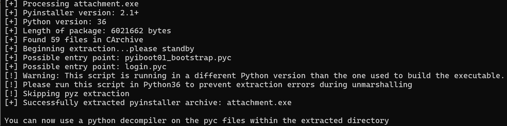

# Reverse - login

python exe attachment reversing
use script `pyinstxtractor.py`

```shell
python pyinstxtractor.py attachment.exe
```

  

retain the magic number using 010 editor to recover structure of `login.pyc`
`33 0D 0D 0A 70 79 69 30 01 01 00 00`

then uncompiler6 login.pyc to get the source code
```python

```