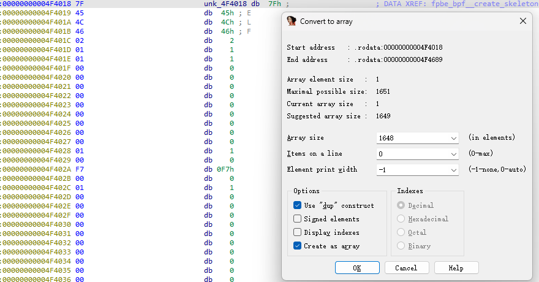

# fpbe

check packer first: no packer
```json
OS: Ubuntu Linux(20.04,ABI: 3.2.0)[AMD64, 64 bits, EXEC]
Compiler: GCC(9.3.0)
```

main function
```c
int __cdecl main(int argc, const char **argv, const char **envp)
{
  int v4; // ecx
  int v5; // r8d
  int v6; // r9d
  int v7; // ecx
  int v8; // r8d
  int v9; // r9d
  int err; // [rsp+14h] [rbp-4Ch]
  unsigned int *array; // [rsp+18h] [rbp-48h]
  fpbe_bpf *skel; // [rsp+20h] [rbp-40h]
  __int64 base_addr; // [rsp+28h] [rbp-38h]
  char flag[17]; // [rsp+40h] [rbp-20h] BYREF
  unsigned __int64 v15; // [rsp+58h] [rbp-8h]

  v15 = __readfsqword(0x28u);
  if ( argc == 2 )
  {
    array = (unsigned int *)argv[1];
    libbpf_set_print((libbpf_print_fn_t)libbpf_print_fn);
    bump_memlock_rlimit();
    skel = fpbe_bpf__open_and_load();
    if ( skel )
    {
      base_addr = get_base_addr();
      if ( base_addr >= 0 )
      {
        skel->links.uprobe = bpf_program__attach_uprobe(
                               skel->progs.uprobe,
                               0,
                               0,
                               "/proc/self/exe",
                               (size_t)uprobed_function - base_addr);
        err = libbpf_get_error(skel->links.uprobe);
        if ( err )
        {
          fprintf((_DWORD)stderr, (unsigned int)"Failed to attach uprobe: %d\n", err, v4, v5, v6, (char)argv);
        }
        else
        {
          puts(
            "Successfully started! Please run `sudo cat /sys/kernel/debug/tracing/trace_pipe` to see output of the BPF programs.");
          err = uprobed_function(*array, array[1], array[2], array[3]);
          memset(flag, 0, sizeof(flag));
          *(_DWORD *)flag = *array;
          *(_DWORD *)&flag[4] = array[1];
          *(_DWORD *)&flag[8] = array[2];
          *(_DWORD *)&flag[12] = array[3];
          if ( err == 1 )
            printf(
              (unsigned int)"flag: HFCTF{%s}\n",
              (unsigned int)flag,
              (unsigned int)&flag[12],
              v7,
              v8,
              v9,
              (char)argv);
          else
            puts("not flag");
        }
      }
      else
      {
        fwrite("Failed to determine process's load address\n", 1LL, 43LL, stderr);
        err = base_addr;
      }
      fpbe_bpf__destroy(skel);
      return -err;
    }
    else
    {
      fwrite("Failed to open and load BPF skeleton\n", 1LL, 37LL, stderr);
      return 1;
    }
  }
  else
  {
    fwrite("Usage: sudo ./fpbe <flag>\n", 1LL, 26LL, stderr);
    return 1;
  }
}
```
BPF reverse, the main logic is in `uprobed_function`

```c
int __cdecl uprobed_function(unsigned int a, unsigned int b, unsigned int c, unsigned int d)
{
  SHA256_CTX ctx; // [rsp+20h] [rbp-E0h] BYREF
  char flag[17]; // [rsp+90h] [rbp-70h] BYREF
  BYTE hash[32]; // [rsp+B0h] [rbp-50h] BYREF
  BYTE buf[32]; // [rsp+D0h] [rbp-30h] BYREF
  unsigned __int64 v9; // [rsp+F8h] [rbp-8h]

  v9 = __readfsqword(0x28u);
  flag[16] = 0;
  *(_DWORD *)flag = a;
  *(_DWORD *)&flag[4] = b;
  *(_DWORD *)&flag[8] = c;
  *(_DWORD *)&flag[12] = d;
  *(_QWORD *)hash = 0x1543E1B29A58BC7BLL;
  *(_QWORD *)&hash[8] = 0xE8E552D9290D81CBLL;
  *(_QWORD *)&hash[16] = 0x515753F0C747283DLL;
  *(_QWORD *)&hash[24] = 0x7C8A5AB2D78ED974LL;
  sha256_init(&ctx);
  sha256_update(&ctx, (const BYTE *)flag, 0x10uLL);
  sha256_final(&ctx, buf);
  return j_memcmp_ifunc(hash, buf, 32LL) == 0;
}
```
SHA256 cant crack it, need to reverse the logic of BPF program

find that `skel = fpbe_bpf__open_and_load();` load the BPF program, dive into it
```c
int __cdecl fpbe_bpf__create_skeleton(fpbe_bpf *obj)
{
  bpf_object_skeleton *s; // [rsp+18h] [rbp-8h]

  s = (bpf_object_skeleton *)calloc(1LL, 72LL);
  if ( !s )
    return -1;
  obj->skeleton = s;
  s->sz = 72LL;
  s->name = "fpbe_bpf";
  s->obj = &obj->obj;
  s->prog_cnt = 1;
  s->prog_skel_sz = 24;
  s->progs = (bpf_prog_skeleton *)calloc(s->prog_cnt, s->prog_skel_sz);
  if ( s->progs )
  {
    s->progs->name = "uprobe";
    s->progs->prog = &obj->progs.uprobe;
    s->progs->link = &obj->links.uprobe;
    s->data_sz = 1648LL;
    s->data = &unk_4F4018;
    return 0;
  }
  else
  {
    bpf_object__destroy_skeleton(s);
    return -1;
  }
}
```

find the ELF file (BPF program), `*` to convert to array for next exporting


data_size = 1648LL, data_addr = 0x00000000004F4018
export the ELF program, and process it using [eBPF Processor](https://github.com/cylance/eBPF_processor), dragging it into IDAPro as BPF arch
```asm
uprobe_func:0000000000000008                               uprobe:
uprobe_func:0000000000000008 79 12 68 00 00 00 00 00       ldxdw          r2, [r1+0x68]
uprobe_func:0000000000000010 67 02 00 00 20 00 00 00       lsh            r2, 0x20
uprobe_func:0000000000000018 77 02 00 00 20 00 00 00       rsh            r2, 0x20
uprobe_func:0000000000000020 79 13 70 00 00 00 00 00       ldxdw          r3, [r1+0x70]
uprobe_func:0000000000000028 67 03 00 00 20 00 00 00       lsh            r3, 0x20
uprobe_func:0000000000000030 77 03 00 00 20 00 00 00       rsh            r3, 0x20
uprobe_func:0000000000000038 BF 34 00 00 00 00 00 00       mov            r4, r3
uprobe_func:0000000000000040 27 04 00 00 C0 6D 00 00       mul            r4, 0x6DC0
uprobe_func:0000000000000048 BF 25 00 00 00 00 00 00       mov            r5, r2
uprobe_func:0000000000000050 27 05 00 00 88 FB 00 00       mul            r5, 0xFB88
uprobe_func:0000000000000058 0F 45 00 00 00 00 00 00       add            r5, r4
uprobe_func:0000000000000060 79 14 60 00 00 00 00 00       ldxdw          r4, [r1+0x60]
uprobe_func:0000000000000068 67 04 00 00 20 00 00 00       lsh            r4, 0x20
uprobe_func:0000000000000070 77 04 00 00 20 00 00 00       rsh            r4, 0x20
uprobe_func:0000000000000078 BF 40 00 00 00 00 00 00       mov            r0, r4
uprobe_func:0000000000000080 27 00 00 00 FB 71 00 00       mul            r0, 0x71FB
uprobe_func:0000000000000088 0F 05 00 00 00 00 00 00       add            r5, r0
uprobe_func:0000000000000090 79 11 58 00 00 00 00 00       ldxdw          r1, [r1+0x58]
uprobe_func:0000000000000098 B7 00 00 00 00 00 00 00       mov            r0, 0
uprobe_func:00000000000000A0 73 0A F8 FF 00 00 00 00       stxb           [r10-8], r0
uprobe_func:00000000000000A8 7B 0A F0 FF 00 00 00 00       stxdw          [r10-0x10], r0
uprobe_func:00000000000000B0 7B 0A E8 FF 00 00 00 00       stxdw          [r10-0x18], r0
uprobe_func:00000000000000B8 67 01 00 00 20 00 00 00       lsh            r1, 0x20
uprobe_func:00000000000000C0 77 01 00 00 20 00 00 00       rsh            r1, 0x20
uprobe_func:00000000000000C8 BF 10 00 00 00 00 00 00       mov            r0, r1
uprobe_func:00000000000000D0 27 00 00 00 8E CC 00 00       mul            r0, 0xCC8E
uprobe_func:00000000000000D8 0F 05 00 00 00 00 00 00       add            r5, r0
uprobe_func:00000000000000E0 B7 06 00 00 01 00 00 00       mov            r6, 1
uprobe_func:00000000000000E8 18 00 00 00 95 59 73 A1 00 00+lddw           r0, 0xBE18A1735995
uprobe_func:00000000000000E8 00 00 18 BE 00 00
uprobe_func:00000000000000F8 5D 05 42 00 00 00 00 00       jne            r5, r0, LBB0_5
uprobe_func:00000000000000F8
uprobe_func:0000000000000100 BF 35 00 00 00 00 00 00       mov            r5, r3
uprobe_func:0000000000000108 27 05 00 00 BF F1 00 00       mul            r5, 0xF1BF
uprobe_func:0000000000000110 BF 20 00 00 00 00 00 00       mov            r0, r2
uprobe_func:0000000000000118 27 00 00 00 E5 6A 00 00       mul            r0, 0x6AE5
uprobe_func:0000000000000120 0F 50 00 00 00 00 00 00       add            r0, r5
uprobe_func:0000000000000128 BF 45 00 00 00 00 00 00       mov            r5, r4
uprobe_func:0000000000000130 27 05 00 00 D3 AD 00 00       mul            r5, 0xADD3
uprobe_func:0000000000000138 0F 50 00 00 00 00 00 00       add            r0, r5
uprobe_func:0000000000000140 BF 15 00 00 00 00 00 00       mov            r5, r1
uprobe_func:0000000000000148 27 05 00 00 84 92 00 00       mul            r5, 0x9284
uprobe_func:0000000000000150 0F 50 00 00 00 00 00 00       add            r0, r5
uprobe_func:0000000000000158 18 05 00 00 40 03 54 E5 00 00+lddw           r5, 0xA556E5540340
uprobe_func:0000000000000158 00 00 56 A5 00 00
uprobe_func:0000000000000168 5D 50 34 00 00 00 00 00       jne            r0, r5, LBB0_5
uprobe_func:0000000000000168
uprobe_func:0000000000000170 BF 35 00 00 00 00 00 00       mov            r5, r3
uprobe_func:0000000000000178 27 05 00 00 85 DD 00 00       mul            r5, 0xDD85
uprobe_func:0000000000000180 BF 20 00 00 00 00 00 00       mov            r0, r2
uprobe_func:0000000000000188 27 00 00 00 28 80 00 00       mul            r0, 0x8028
uprobe_func:0000000000000190 0F 50 00 00 00 00 00 00       add            r0, r5
uprobe_func:0000000000000198 BF 45 00 00 00 00 00 00       mov            r5, r4
uprobe_func:00000000000001A0 27 05 00 00 2D 65 00 00       mul            r5, 0x652D
uprobe_func:00000000000001A8 0F 50 00 00 00 00 00 00       add            r0, r5
uprobe_func:00000000000001B0 BF 15 00 00 00 00 00 00       mov            r5, r1
uprobe_func:00000000000001B8 27 05 00 00 12 E7 00 00       mul            r5, 0xE712
uprobe_func:00000000000001C0 0F 50 00 00 00 00 00 00       add            r0, r5
uprobe_func:00000000000001C8 18 05 00 00 A3 4D 48 74 00 00+lddw           r5, 0xA6F374484DA3
uprobe_func:00000000000001C8 00 00 F3 A6 00 00
uprobe_func:00000000000001D8 5D 50 26 00 00 00 00 00       jne            r0, r5, LBB0_5
uprobe_func:00000000000001D8
uprobe_func:00000000000001E0 BF 35 00 00 00 00 00 00       mov            r5, r3
uprobe_func:00000000000001E8 27 05 00 00 2C 82 00 00       mul            r5, 0x822C
uprobe_func:00000000000001F0 BF 20 00 00 00 00 00 00       mov            r0, r2
uprobe_func:00000000000001F8 27 00 00 00 43 CA 00 00       mul            r0, 0xCA43
uprobe_func:0000000000000200 0F 50 00 00 00 00 00 00       add            r0, r5
uprobe_func:0000000000000208 BF 45 00 00 00 00 00 00       mov            r5, r4
uprobe_func:0000000000000210 27 05 00 00 8E 7C 00 00       mul            r5, 0x7C8E
uprobe_func:0000000000000218 0F 50 00 00 00 00 00 00       add            r0, r5
uprobe_func:0000000000000220 BF 15 00 00 00 00 00 00       mov            r5, r1
uprobe_func:0000000000000228 27 05 00 00 3A F2 00 00       mul            r5, 0xF23A
uprobe_func:0000000000000230 0F 50 00 00 00 00 00 00       add            r0, r5
uprobe_func:0000000000000238 18 05 00 00 77 72 5A 48 00 00+lddw           r5, 0xB99C485A7277
uprobe_func:0000000000000238 00 00 9C B9 00 00
uprobe_func:0000000000000248 5D 50 18 00 00 00 00 00       jne            r0, r5, LBB0_5
uprobe_func:0000000000000248
uprobe_func:0000000000000250 63 1A F4 FF 00 00 00 00       stxw           [r10-0xC], r1
uprobe_func:0000000000000258 63 4A F0 FF 00 00 00 00       stxw           [r10-0x10], r4
uprobe_func:0000000000000260 63 2A EC FF 00 00 00 00       stxw           [r10-0x14], r2
uprobe_func:0000000000000268 63 3A E8 FF 00 00 00 00       stxw           [r10-0x18], r3
uprobe_func:0000000000000270 18 01 00 00 43 54 46 7B 00 00+lddw           r1, 0xA7D73257B465443
uprobe_func:0000000000000270 00 00 25 73 7D 0A
uprobe_func:0000000000000280 7B 1A D8 FF 00 00 00 00       stxdw          [r10-0x28], r1
uprobe_func:0000000000000288 18 01 00 00 46 4C 41 47 00 00+lddw           r1, 0x4648203A47414C46
uprobe_func:0000000000000288 00 00 3A 20 48 46
uprobe_func:0000000000000298 7B 1A D0 FF 00 00 00 00       stxdw          [r10-0x30], r1
uprobe_func:00000000000002A0 18 01 00 00 45 21 20 59 00 00+lddw           r1, 0x2052554F59202145
uprobe_func:00000000000002A0 00 00 4F 55 52 20
uprobe_func:00000000000002B0 7B 1A C8 FF 00 00 00 00       stxdw          [r10-0x38], r1
uprobe_func:00000000000002B8 18 01 00 00 57 45 4C 4C 00 00+lddw           r1, 0x4E4F44204C4C4557
uprobe_func:00000000000002B8 00 00 20 44 4F 4E
uprobe_func:00000000000002C8 7B 1A C0 FF 00 00 00 00       stxdw          [r10-0x40], r1
uprobe_func:00000000000002D0 B7 06 00 00 00 00 00 00       mov            r6, 0
uprobe_func:00000000000002D8 73 6A E0 FF 00 00 00 00       stxb           [r10-0x20], r6
uprobe_func:00000000000002E0 BF A1 00 00 00 00 00 00       mov            r1, r10
uprobe_func:00000000000002E8 07 01 00 00 C0 FF FF FF       add            r1, -0x40
uprobe_func:00000000000002F0 BF A3 00 00 00 00 00 00       mov            r3, r10
uprobe_func:00000000000002F8 07 03 00 00 E8 FF FF FF       add            r3, -0x18
uprobe_func:0000000000000300 B7 02 00 00 21 00 00 00       mov            r2, 0x21
uprobe_func:0000000000000308 85 00 00 00 06 00 00 00       call           6
uprobe_func:0000000000000308
uprobe_func:0000000000000310
uprobe_func:0000000000000310                               LBB0_5:                                 ; CODE XREF: uprobe+F0↑j
uprobe_func:0000000000000310                                                                       ; uprobe+160↑j
uprobe_func:0000000000000310                                                                       ; uprobe+1D0↑j
uprobe_func:0000000000000310                                                                       ; uprobe+240↑j
uprobe_func:0000000000000310 BF 60 00 00 00 00 00 00       mov            r0, r6
uprobe_func:0000000000000318 95 00 00 00 00 00 00 00       ret
```

analyze it refering to [BPF Doc](https://www.kernel.org/doc/html/latest/bpf/instruction-set.html)
The logic of BPF program is a equation check, Z3 solves it to get x0, x1, x2, x3 values
```python
# [r1+0x68] -> x2 -> r2
# [r1+0x70] -> x3 -> r3
# [r1+0x60] -> x1 -> r4
# [r1+0x58] -> x0 -> r1

x2*0xFB88 + x3*0x6DC0 + x1*0x71FB + x0*0xCC8E == 0xBE18A1735995
x3*0xF1BF + x2*0x6AE5 + x1*0xADD3 + x0*0x9284 == 0xA556E5540340
x3*0xDD85 + x2*0x8028 + x1*0x652D + x0*0xE712 == 0xA6F374484DA3
x3*0x822C + x2*0xCA43 + x1*0x7C8E + x0*0xF23A == 0xB99C485A7277
```
