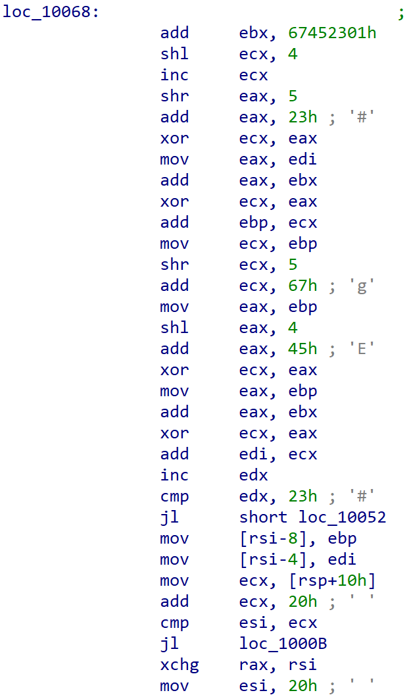
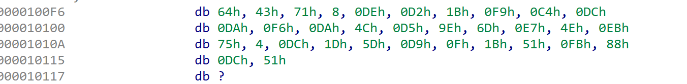

# small

IDApro open the small binary
at the address `0x010068`, press `c` to analyze the asm code
read the assembly code directly

TEA algorithm, delta is `0x67452301`, round number is `0x23`

extract `0x0100F7` address data, get the encrypted data

write the TEA decryption algorithm to reverse the flag
 