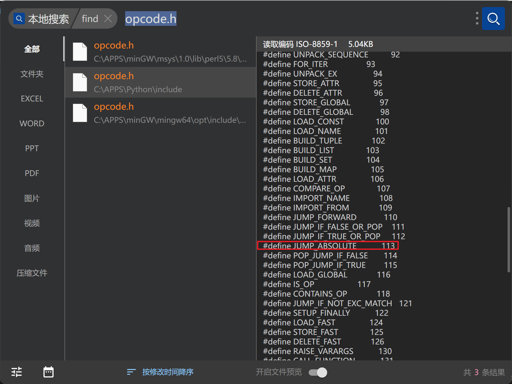

# Reverse - BabyMaze

[Reference Link](https://www.bilibili.com/video/BV1ka411k7td/)

### Solution 1
Tools: pycdc
```shell
cd /path/to/your/tools
git clone https://github.com/zrax/pycdc.git
cd pycdc
mkdir build && cd build
cmake ..
make
```

Disassembling
```shell
./pycdas /path/to/VNCTF2022/BabyMaze/BabyMaze.pyc -o /path/to/VNCTF2022/BabyMaze/BabyMaze.disa
```

all bytecodes see `BabyMaze.disa`
main logic is below:
```python
                0       LOAD_GLOBAL                     0: print
                2       LOAD_CONST                      1: 'Welcome To VNCTF2022!!!'
                4       CALL_FUNCTION                   1
                6       POP_TOP                         
                8       LOAD_GLOBAL                     0: print
                10      LOAD_CONST                      2: 'Hello Mr. X, this time your mission is to get out of this maze this time.(FIND THAT 7!)'
                12      CALL_FUNCTION                   1
                14      POP_TOP                         
                16      LOAD_GLOBAL                     0: print
                18      LOAD_CONST                      3: 'you are still doing the mission alone, this tape will self-destruct in five seconds.'
                20      CALL_FUNCTION                   1
                22      POP_TOP                         
                24      LOAD_GLOBAL                     1: maze
                26      CALL_FUNCTION                   0
                28      POP_JUMP_IF_FALSE               40
                30      LOAD_GLOBAL                     0: print
                32      LOAD_CONST                      4: 'Congratulation! flag: VNCTF{md5(your input)}'
                34      CALL_FUNCTION                   1
                36      POP_TOP                         
                38      JUMP_FORWARD                    8 (to 48)
                40      LOAD_GLOBAL                     0: print
                42      LOAD_CONST                      5: "Sorry, we won't acknowledge the existence of your squad."
                44      CALL_FUNCTION                   1
                46      POP_TOP                         
                48      LOAD_CONST                      0: None
                50      RETURN_VALUE                    
        'main'
        '__main__'
        None
```
reverse the main logic to python code then extract the map data
write DFS algorithm to find the path of maze

### Solution 2
Dependencies: Python==3.8, uncompyle6
```shell
pip install uncompyle6
```

```python
f = open('BabyMaze.pyc', 'rb').read()
code = marshal.loads(f[16:])
dis.dis(code)
print(len(code.co_code)) # 2030
```

remove the obfuscating bytecodes at the beginning of Disassembly
```python
        0       JUMP_ABSOLUTE                   4
        2       JUMP_ABSOLUTE                   6
        4       JUMP_ABSOLUTE                   2
```

  


and fix the code.co_code to 2030 - 6 = 2024 using 010 editor, then `uncompyle6.exe .\BabyMaze.pyc` 
we can get the decompiled python code
```python
# uncompyle6 version 3.9.2
# Python bytecode version base 3.8.0 (3413)
# Decompiled from: Python 3.8.10 (default, Jul 29 2024, 17:02:10) 
# [GCC 9.4.0]
# Embedded file name: .\BabyMaze.py
# Compiled at: 2022-02-08 15:12:27
# Size of source mod 2**32: 3707 bytes
_map = [
 [
  1, 1, 1, 1, 1, 1, 1, 1, 1, 1, 1, 1, 1, 1, 1, 1, 1, 1, 1, 
  1, 1, 1, 1, 1, 1, 1, 1, 1, 1, 1, 1], [1, 5, 1, 0, 0, 0, 0, 0, 0, 0, 0, 0, 0, 0, 0, 0, 0, 0, 0, 0, 1, 
  0, 0, 0, 0, 0, 0, 0, 0, 0, 1], [1, 0, 1, 0, 1, 1, 1, 1, 1, 1, 1, 1, 1, 0, 1, 1, 1, 1, 1, 0, 1, 
  0, 1, 1, 1, 1, 1, 1, 1, 0, 1], [1, 0, 1, 0, 0, 0, 1, 0, 0, 0, 0, 0, 0, 0, 1, 0, 0, 0, 1, 0, 0, 
  0, 1, 0, 1, 0, 0, 0, 1, 0, 1], [1, 0, 1, 1, 1, 1, 1, 0, 1, 1, 1, 1, 1, 1, 1, 1, 1, 0, 1, 1, 1, 
  1, 1, 0, 1, 0, 1, 0, 1, 0, 1], [1, 0, 0, 0, 1, 0, 0, 0, 1, 0, 0, 0, 0, 0, 0, 0, 0, 0, 0, 0, 0, 
  0, 1, 0, 0, 0, 1, 0, 0, 0, 1], [1, 1, 1, 0, 1, 0, 1, 1, 1, 0, 1, 1, 1, 1, 1, 1, 1, 1, 1, 1, 1, 
  1, 1, 0, 1, 1, 1, 1, 1, 1, 1], [1, 0, 0, 0, 1, 0, 1, 0, 0, 0, 1, 0, 0, 0, 0, 0, 0, 0, 0, 0, 1, 
  0, 0, 0, 1, 0, 0, 0, 1, 0, 1], [1, 0, 1, 1, 1, 0, 1, 0, 1, 1, 1, 0, 1, 1, 1, 1, 1, 1, 1, 0, 1, 
  0, 1, 1, 1, 0, 1, 0, 1, 0, 1], [1, 0, 0, 0, 0, 0, 1, 0, 1, 0, 0, 0, 1, 0, 0, 0, 1, 0, 1, 0, 1, 
  0, 0, 0, 1, 0, 1, 0, 0, 0, 1], [1, 1, 1, 1, 1, 1, 1, 0, 1, 0, 1, 1, 1, 0, 1, 0, 1, 0, 1, 0, 1, 
  1, 1, 0, 1, 0, 1, 1, 1, 0, 1], [1, 0, 0, 0, 0, 0, 0, 0, 1, 0, 0, 0, 0, 0, 1, 0, 0, 0, 1, 0, 1, 
  0, 0, 0, 1, 0, 1, 0, 0, 0, 1], [1, 0, 1, 1, 1, 1, 1, 1, 1, 1, 1, 1, 1, 1, 1, 1, 1, 0, 1, 0, 1, 
  0, 1, 1, 1, 0, 1, 0, 1, 1, 1], [1, 0, 0, 0, 0, 0, 0, 0, 1, 0, 0, 0, 0, 0, 0, 0, 1, 0, 1, 0, 0, 
  0, 1, 0, 0, 0, 1, 0, 0, 0, 1], [1, 0, 1, 1, 1, 1, 1, 0, 1, 0, 1, 0, 1, 0, 1, 1, 1, 0, 1, 1, 1, 
  1, 1, 0, 1, 1, 1, 1, 1, 1, 1], [1, 0, 1, 0, 0, 0, 1, 0, 1, 0, 1, 0, 1, 0, 1, 0, 0, 0, 1, 0, 0, 
  0, 0, 0, 0, 0, 0, 0, 0, 0, 1], [1, 0, 1, 0, 1, 0, 1, 0, 1, 0, 1, 0, 1, 1, 1, 0, 1, 1, 1, 0, 1, 
  1, 1, 1, 1, 0, 1, 1, 1, 0, 1], [1, 0, 1, 0, 1, 0, 1, 0, 1, 0, 1, 0, 0, 0, 1, 0, 0, 0, 1, 0, 1, 
  0, 0, 0, 1, 0, 1, 0, 0, 0, 1], [1, 0, 1, 0, 1, 1, 1, 0, 1, 0, 1, 1, 1, 0, 1, 1, 1, 0, 1, 0, 1, 
  0, 1, 0, 1, 1, 1, 0, 1, 1, 1], [1, 0, 0, 0, 1, 0, 0, 0, 1, 0, 1, 0, 0, 0, 0, 0, 1, 0, 1, 0, 1, 
  0, 1, 0, 0, 0, 1, 0, 0, 0, 1], [1, 0, 1, 1, 1, 0, 1, 0, 1, 0, 1, 0, 1, 1, 1, 1, 1, 0, 1, 0, 1, 
  0, 1, 1, 1, 0, 1, 0, 1, 0, 1], [1, 0, 1, 0, 0, 0, 1, 0, 1, 0, 1, 0, 0, 0, 0, 0, 0, 0, 1, 0, 1, 
  0, 1, 0, 1, 0, 1, 0, 1, 0, 1], [1, 0, 1, 0, 1, 1, 1, 0, 1, 0, 1, 1, 1, 1, 1, 1, 1, 1, 1, 1, 1, 
  0, 1, 0, 1, 0, 1, 0, 1, 0, 1], [1, 0, 1, 0, 0, 0, 1, 0, 1, 0, 1, 0, 0, 0, 0, 0, 0, 0, 0, 0, 1, 
  0, 1, 0, 1, 0, 1, 0, 1, 0, 1], [1, 0, 1, 1, 1, 0, 1, 0, 1, 0, 1, 1, 1, 1, 1, 0, 1, 0, 1, 0, 1, 
  0, 1, 0, 1, 0, 1, 0, 1, 0, 1], [1, 0, 0, 0, 1, 0, 1, 0, 1, 0, 0, 0, 0, 0, 1, 0, 1, 0, 1, 0, 0, 
  0, 1, 0, 0, 0, 1, 0, 1, 0, 1], [1, 1, 1, 1, 1, 0, 1, 1, 1, 1, 1, 1, 1, 0, 1, 1, 1, 0, 1, 1, 1, 
  1, 1, 1, 1, 0, 1, 1, 1, 0, 1], [1, 0, 0, 0, 0, 0, 1, 0, 0, 0, 0, 0, 1, 0, 0, 0, 1, 0, 0, 0, 0, 
  0, 0, 0, 1, 0, 0, 0, 0, 0, 1], [1, 0, 1, 1, 1, 1, 1, 0, 1, 1, 1, 0, 1, 1, 1, 0, 1, 1, 1, 1, 1, 
  1, 1, 0, 1, 1, 1, 1, 1, 0, 1], [1, 0, 0, 0, 0, 0, 0, 0, 0, 0, 1, 0, 0, 0, 0, 0, 0, 0, 0, 0, 0, 
  0, 0, 0, 1, 0, 0, 0, 0, 7, 1], [1, 1, 1, 1, 1, 1, 1, 1, 1, 1, 1, 1, 1, 1, 1, 1, 1, 1, 1, 1, 1, 
  1, 1, 1, 1, 1, 1, 1, 1, 1, 1]]

def maze():
    x = 1
    y = 1
    step = input()
    for i in range(len(step)):
        if step[i] == "w":
            x -= 1
        else:
            if step[i] == "s":
                x += 1
            else:
                if step[i] == "a":
                    y -= 1
                else:
                    if step[i] == "d":
                        y += 1
                    else:
                        return False
        if _map[x][y] == 1:
            return False
        if x == 29 and y == 29:
            return True


def main():
    print("Welcome To VNCTF2022!!!")
    print("Hello Mr. X, this time your mission is to get out of this maze this time.(FIND THAT 7!)")
    print("you are still doing the mission alone, this tape will self-destruct in five seconds.")
    if maze():
        print("Congratulation! flag: VNCTF{md5(your input)}")
    else:
        print("Sorry, we won't acknowledge the existence of your squad.")


if __name__ == "__main__":
    main()

# okay decompiling BabyMaze.pyc
```

use DFS algorithm to write the rev script, see `rev.py`
